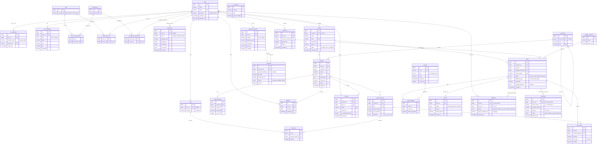

# ecommerce ER Diagram

```mermaid
erDiagram
    %% ==========================================
    %% 1. USERS, IAM & ACCESS CONTROL
    %% ==========================================
    users {
        bigint id PK
        varchar name
        varchar email UK
        varchar password "nullable for SSO"
        timestamp created_at
        timestamp updated_at
    }
    sso_identities {
        bigint id PK
        bigint user_id FK
        varchar provider_name "google, apple"
        varchar provider_id UK
        timestamp created_at
    }
    user_addresses {
        bigint id PK
        bigint user_id FK
        enum type "billing, shipping"
        varchar street
        varchar city
        varchar zip
        boolean is_default
    }

    %% ==========================================
    %% 2. ADVANCED RBAC (Spatie Permission)
    %% ==========================================
    roles {
        bigint id PK
        varchar name UK "Super Admin, Vendor, Driver"
    }
    permissions {
        bigint id PK
        varchar name UK
    }
    role_has_permissions {
        bigint role_id FK
        bigint permission_id FK
    }
    model_has_roles {
        bigint role_id FK
        bigint model_id FK "user_id"
    }
    model_has_permissions {
        bigint permission_id FK
        bigint model_id FK "user_id"
    }

    %% ==========================================
    %% 3. SECURITY & AUDIT LOGS
    %% ==========================================
    audit_logs {
        bigint id PK
        bigint user_id FK "nullable"
        varchar event "created, updated, deleted"
        varchar auditable_type
        bigint auditable_id
        jsonb old_values
        jsonb new_values
        timestamp created_at
    }

    %% ==========================================
    %% 4. MULTI-VENDOR MARKETPLACE
    %% ==========================================
    shops {
        bigint id PK
        bigint vendor_id FK "users.id"
        varchar name
        varchar slug UK
        text description
        varchar logo_url
        enum status "pending, active, suspended"
        timestamp created_at
    }

    %% ==========================================
    %% 5. PRODUCT CATALOG
    %% ==========================================
    categories {
        bigint id PK
        bigint parent_id FK "nullable"
        varchar name
        varchar slug UK
    }
    products {
        bigint id PK
        bigint shop_id FK
        bigint category_id FK
        varchar name
        varchar slug UK
        text description
        decimal base_price
        enum status
        timestamp deleted_at
    }
    product_variants {
        bigint id PK
        bigint product_id FK
        varchar sku UK
        integer stock_quantity
        decimal price_modifier
        jsonb attributes "e.g., size, color"
    }
    product_images {
        bigint id PK
        bigint product_id FK
        varchar image_url
        boolean is_primary
        integer sort_order
    }

    %% ==========================================
    %% 6. CUSTOMER EXPERIENCE
    %% ==========================================
    wishlists {
        bigint id PK
        bigint user_id FK
        bigint product_id FK
        timestamp created_at
    }
    reviews {
        bigint id PK
        bigint product_id FK
        bigint user_id FK
        smallint rating "1-5"
        text comment
        boolean is_verified_purchase
        timestamp created_at
    }

    %% ==========================================
    %% 7. SHOPPING CART
    %% ==========================================
    carts {
        bigint id PK
        bigint user_id FK "nullable"
        varchar session_id "for guests"
    }
    cart_items {
        bigint id PK
        bigint cart_id FK
        bigint product_variant_id FK
        integer quantity
    }

    %% ==========================================
    %% 8. MARKETING & TAXES
    %% ==========================================
    coupons {
        bigint id PK
        varchar code UK
        enum type "percentage, fixed"
        decimal value
        timestamp valid_until
        integer usage_limit
    }
    shipping_methods {
        bigint id PK
        varchar name
        decimal base_cost
    }
    tax_rates {
        bigint id PK
        varchar country
        varchar state
        decimal rate_percentage
    }

    %% ==========================================
    %% 9. CHECKOUT & PAYMENTS (Unified)
    %% ==========================================
    checkouts {
        bigint id PK
        bigint user_id FK
        varchar checkout_reference UK
        decimal grand_total
        enum status
        timestamp created_at
    }
    payment_methods {
        bigint id PK
        bigint user_id FK
        varchar provider "stripe, paypal"
        varchar provider_token
        varchar card_brand
        varchar last_four
        boolean is_default
    }
    payments {
        bigint id PK
        bigint checkout_id FK
        bigint payment_method_id FK "nullable"
        varchar provider
        varchar transaction_id
        enum status "pending, completed, failed"
        decimal amount
    }

    %% ==========================================
    %% 10. SPLIT ORDERS & POST-PURCHASE
    %% ==========================================
    orders {
        bigint id PK
        bigint checkout_id FK
        bigint shop_id FK
        bigint shipping_method_id FK
        varchar order_number UK
        enum status "pending, ready, shipped, delivered"
        enum fulfillment_type "in_house, third_party"
        decimal shop_total
        jsonb shipping_address "snapshot"
        timestamp created_at
    }
    order_items {
        bigint id PK
        bigint order_id FK
        bigint product_variant_id FK
        integer quantity
        decimal unit_price "snapshot"
        decimal subtotal
    }
    order_coupons {
        bigint id PK
        bigint order_id FK
        bigint coupon_id FK
        decimal discount_applied
    }
    returns {
        bigint id PK
        bigint order_id FK
        enum status "pending, approved, refunded"
        text reason
        decimal refund_amount
        timestamp created_at
    }

    %% ==========================================
    %% 11. HYBRID LOGISTICS (In-House vs Express)
    %% ==========================================
    deliveries {
        bigint id PK
        bigint order_id FK "In-House Route"
        bigint driver_id FK "users.id"
        enum status "assigned, picked_up, out_for_delivery, delivered"
        varchar proof_of_delivery_url "S3 image"
        timestamp delivered_at
    }
    shipments {
        bigint id PK
        bigint order_id FK "Third-Party Route"
        varchar courier_name "e.g., J&T Express"
        varchar tracking_number
        varchar label_url "PDF URL"
        enum status "label_created, in_transit, delivered"
        timestamp delivered_at
    }

    %% ==========================================
    %% RELATIONSHIPS DEFINITION
    %% ==========================================
    users ||--o{ sso_identities : "logs_in_via"
    users ||--o{ user_addresses : "has"
    users ||--o| shops : "manages"
    users ||--o{ wishlists : "saves"
    users ||--o{ payment_methods : "saves"
    users ||--o{ audit_logs : "performs_action"
    users ||--o{ reviews : "writes"
    users ||--o| carts : "owns"
    users ||--o{ checkouts : "initiates"
    users ||--o{ deliveries : "drives_for"
    
    roles ||--o{ role_has_permissions : "grants"
    permissions ||--o{ role_has_permissions : "assigned_to"
    roles ||--o{ model_has_roles : "assigned_to"
    users ||--o{ model_has_roles : "has_role"
    permissions ||--o{ model_has_permissions : "assigned_to"
    users ||--o{ model_has_permissions : "has_direct_permission"

    shops ||--o{ products : "sells"
    shops ||--o{ orders : "fulfills"

    categories ||--o{ categories : "parent_of"
    categories ||--o{ products : "contains"
    
    products ||--o{ product_variants : "has"
    products ||--o{ product_images : "has"
    products ||--o{ wishlists : "saved_in"
    products ||--o{ reviews : "receives"
    
    carts ||--o{ cart_items : "contains"
    product_variants ||--o{ cart_items : "added_to"
    
    checkouts ||--o{ orders : "splits_into"
    checkouts ||--o| payments : "paid_via"
    payment_methods ||--o{ payments : "used_for"
    
    orders ||--o{ order_items : "contains"
    orders ||--o| returns : "has_returns"
    orders ||--o| order_coupons : "uses"
    orders ||--o| deliveries : "dispatched_internally"
    orders ||--o| shipments : "dispatched_externally"
    
    product_variants ||--o{ order_items : "fulfilled_as"
    shipping_methods ||--o{ orders : "used_by"
    coupons ||--o{ order_coupons : "applied_to"
```
